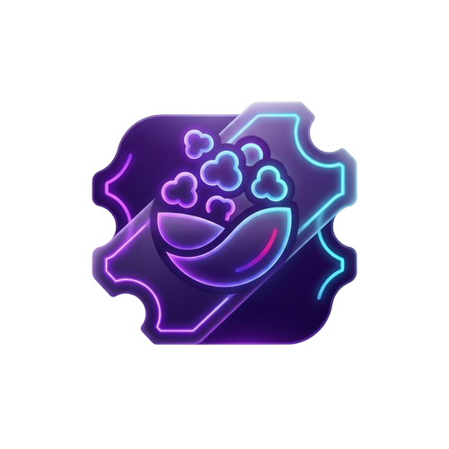

<div align="center">
  
  <h1 align="center">CineTrack</h1>
  <p align="center">
    <strong>A high-performance movie companion app built with React & GSAP.</strong>
  </p>
  <p align="center">
    <a href="https://reactjs.org/"></a>
    <a href="https://greensock.com/gsap/"></a>
    <a href="https://developer.mozilla.org/en-US/docs/Web/JavaScript"></a>
    <a href="https://opensource.org/licenses/MIT"></a>
  </p>
</div>

---

## 📽️ Overview

**CineTrack** is a modern, responsive web application designed for movie enthusiasts to search, explore, and curate their personal watchlists. Built with React and animated using GSAP, it offers a seamless and cinematic user experience characterized by a premium glassmorphic UI, robust state management, and real-time interaction with the OMDb API.

## 🚀 Key Features

*   **Dynamic Search:** Real-time integration with the OMDb API featuring search debouncing and intelligent request abortion.
*   **Cinematic Experience:** Premium UI with staggered list reveals, clean smooth panel transitions powered by GSAP, and a minimalist dark mode aesthetic.
*   **Persistent State:** Seamless synchronization between the main application state and browser `localStorage` to save your watchlist across sessions.
*   **Advanced Metrics:** Real-time aggregation of IMDb ratings, personal user ratings, and cumulative viewing duration.
*   **Robust Error Handling:** Comprehensive edge-case management covering network failures, missing data, and API-level errors seamlessly.

## 🛠️ Tech Stack

*   **Frontend Framework:** React 18 (Hooks, Custom Hooks)
*   **Styling:** Vanilla CSS3 (Glassmorphism, Flexbox, Grid, CSS Variables)
*   **Animation Engine:** GSAP (GreenSock Animation Platform)
*   **Data Fetching:** Native Fetch API with `AbortController`
*   **API:** OMDb API (Open Movie Database)

## 🏁 Quick Start

Follow these instructions to set up the project locally on your machine for development and testing purposes.

### 1. Prerequisites
Ensure you have Node.js and npm installed on your local machine.
*   Node.js (v14.x or higher)
*   npm (v6.x or higher)

### 2. Installation
Clone the repository and install the necessary dependencies:

```bash
git clone https://github.com/sami-dev-dz/cinetrack.git
cd cinetrack
npm install
```

### 3. Environment Variables

To run this project, you will need to add your OMDb API key.

Copy the example environment file and add your key:
```bash
cp .env.example .env
```

Then edit `.env` and replace with your actual API key:
```
REACT_APP_OMDB_API_KEY=your_omdb_api_key_here
```
> **Note:** You can obtain a free API key by registering at [http://www.omdbapi.com/apikey.aspx](http://www.omdbapi.com/apikey.aspx).

### 4. Development Server

Start the application in development mode:

```bash
npm start
```

Open [http://localhost:3000](http://localhost:3000) to view it in your browser. The page will reload when you make changes. You may also see any lint errors in the console.

## 📁 Folder Structure

The codebase is organized in a modular, feature-first structure to ensure scalability and maintainability:

```
CineTrack/
├── public/                 # Static assets (logo, favicon, index.html)
├── src/                    # Main application source code
│   ├── components/         # Reusable atomic UI components (e.g., MovieDetails, Logo, StarRating)
│   ├── hooks/              # Custom React hooks containing abstracted logic (e.g., useMovies)
│   ├── styles/             # Application-wide stylesheets with CSS tokens and base styles
│   ├── utils/              # Helper functions, constants, and global variables
│   ├── App.js              # Root component establishing application layout
│   └── index.js            # Entry point for React DOM rendering
├── package.json            # Project metadata and dependencies tree
└── README.md               # Extensive project documentation
```

## 🤝 Contributing

Contributions are what make the open-source community such an amazing place to learn, inspire, and create. Any contributions you make are **greatly appreciated**.

1. Fork the Project
2. Create your Feature Branch (`git checkout -b feature/AmazingFeature`)
3. Commit your Changes (`git commit -m 'Add some AmazingFeature'`)
4. Push to the Branch (`git push origin feature/AmazingFeature`)
5. Open a Pull Request

## 📄 License

Distributed under the MIT License. See `LICENSE` for more information.

---

<div align="center">
  <p>Built with precision. Designed for performance. 🎬</p>
</div>
